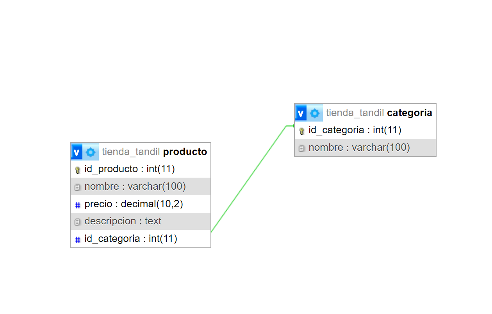

# Tienda Tandil

Este repositorio contiene un sistema diseñado para gestionar el catálogo de la pagina web [Tienda Tandil](https://manumontodev.github.io/TPE-WEB1/), desarrollada para el TPE de la materia Web 1.

## Integrantes: 
- Montoya, Manuel
- Gomes, Matias Leonardo

## Diagrama:

### El diagrama muestra las relaciones entre las dos tablas:

- **Categorías**: se almacenan los distintos tipos de componentes y productos a la venta: teclados, microprocesadores, placas de video y perifericos.
- **Productos**: se almacena cada producto unico: nombre, precio y descripción.

